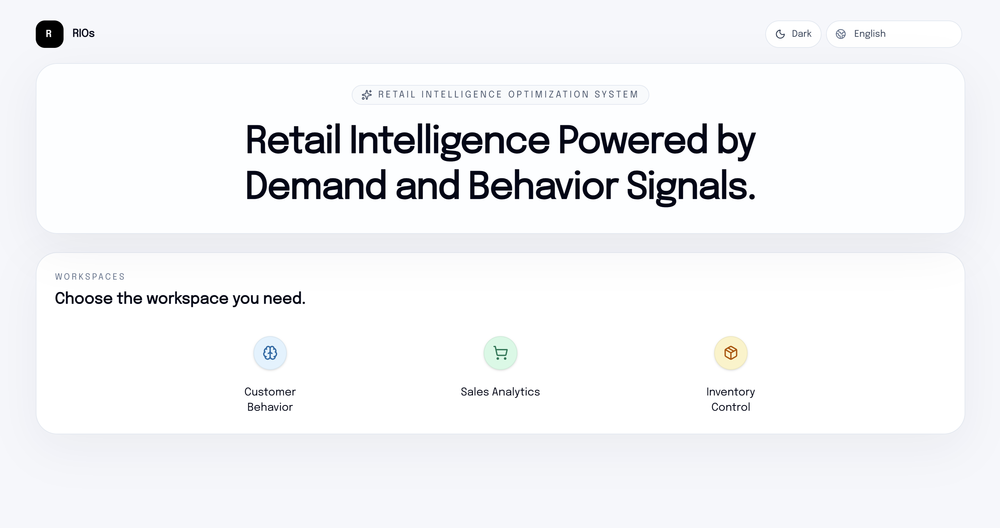
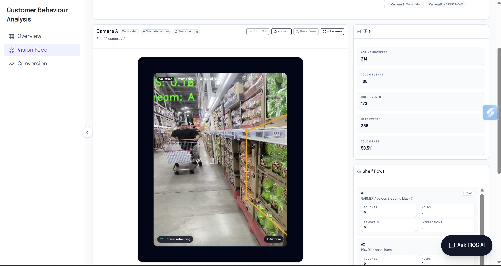
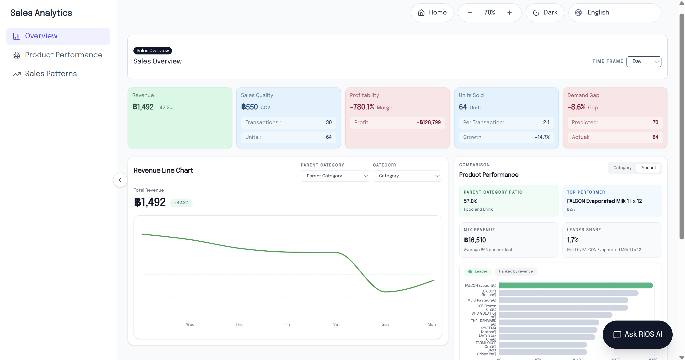
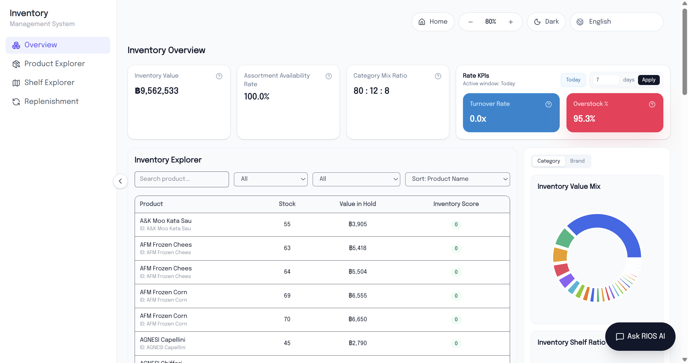
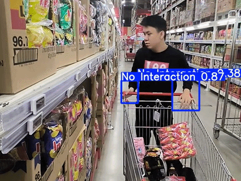
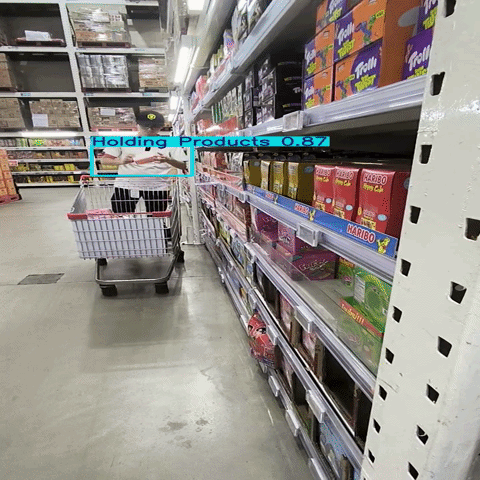

<div align="center">

# RIOS

<strong>Retail Intelligence Optimization System</strong>

<p>A system that translates in-store customer behavior into operational and commercial decisions.</p>

<sub>From shelf interaction to business decision pipeline</sub>

<br /><br />
<p align="center">
  
  
  
  
  
  
  
  
  
  
  
  
  
  
  
  
  
</p>

<br /><br />

<a href="https://github.com/bNhN-0/RIOS-----Retail-Intelligence-Optimization-System">Repository</a>
&nbsp;&nbsp;|&nbsp;&nbsp;
<a href="#4-system-flow">Architecture</a>
&nbsp;&nbsp;|&nbsp;&nbsp;
<a href="#11-run-locally">Run Locally</a>

</div>

<br />

<table align="center">
  <tr>
    <td align="center" width="33%">
      <strong>Observe</strong><br />
      <sub>Capture shelf-level customer behavior before checkout</sub>
    </td>
    <td align="center" width="33%">
      <strong>Connect</strong><br />
      <sub>Link CV events to retail analytics, inventory, and sales intelligence</sub>
    </td>
    <td align="center" width="33%">
      <strong>Decide</strong><br />
      <sub>Surface KPIs, reports, and actions inside one operator-facing interface</sub>
    </td>
  </tr>
</table>

---

## 1. System Overview

<table align="center">
  <tr>
    <td valign="top" width="58%">
      RIOS is an end-to-end retail intelligence system built around a simple gap in most store analytics: retailers usually know <strong>what sold</strong>, but they do not know <strong>what customers considered, touched, held, removed, or ignored before purchase</strong>.
      <br /><br />
      The platform closes that gap by combining computer vision signals, application services, retail data workflows, analytics dashboards, and AI-assisted reporting into one operating layer.
    </td>
    <td valign="top" width="42%">
      <strong>System Outcome</strong>
      <br /><br />
      RIOS helps teams move from <strong>transactional reporting</strong> to <strong>behavior-aware retail decision-making</strong>.
    </td>
  </tr>
</table>

---

## 2. Why RIOS Exists

Traditional POS systems and dashboards are effective at recording completed transactions: what was sold, when, and how much.

What they usually fail to explain is lost intent before checkout.

<table align="center">
  <tr>
    <th align="left">Blind Spot</th>
    <th align="left">Operational Consequence</th>
  </tr>
  <tr>
    <td>attention without purchase</td>
    <td>conversion opportunities remain hidden</td>
  </tr>
  <tr>
    <td>strong shelf interaction</td>
    <td>stock, pricing, or placement issues may go unnoticed</td>
  </tr>
  <tr>
    <td>weak connection between demand and behavior</td>
    <td>inventory decisions lose context</td>
  </tr>
  <tr>
    <td>slow response timing</td>
    <td>teams react after revenue has already been lost</td>
  </tr>
</table>

<br />

RIOS was designed to make pre-purchase behavior measurable and useful. It turns raw shelf activity into signals that support replenishment, assortment review, placement changes, pricing investigation, and performance monitoring.

---

## 3. Key Capabilities

<table>
  <tr>
    <td valign="top" width="50%">
      <strong>1. Behavior-Aware Shelf Intelligence</strong>
      <br /><br />
      - detects <strong>touch</strong>, <strong>hold</strong>, <strong>item removed</strong>, and <strong>no interaction</strong><br />
      - tracks shelf-level activity and interaction intensity<br />
      - supports live-feed and heatmap-style monitoring<br />
      - highlights where intent is building and where it is being lost
    </td>
    <td valign="top" width="50%">
      <strong>2. Connected Sales Analytics</strong>
      <br /><br />
      - revenue trends and product performance analysis<br />
      - category and product contribution views<br />
      - conversion-oriented comparisons between demand and purchase outcomes<br />
      - anomaly and pattern detection across time windows
    </td>
  </tr>
  <tr>
    <td valign="top" width="50%">
      <strong>3. Inventory and Replenishment Visibility</strong>
      <br /><br />
      - inventory value and assortment availability analysis<br />
      - shelf-vs-inventory ratio visibility<br />
      - product explorer and inventory snapshots<br />
      - replenishment planning and ordering workflows
    </td>
    <td valign="top" width="50%">
      <strong>4. AI Reporting Layer</strong>
      <br /><br />
      - context-aware summaries<br />
      - report generation from live dashboard state<br />
      - practical recommendations tied to observed metrics<br />
      - decision support without leaving the workspace
    </td>
  </tr>
</table>

<br />

<div>
  <strong>5. Deployment-Oriented Design</strong>
  <br /><br />
  - built around real application workflows rather than static presentation only<br />
  - structured for camera-driven retail environments<br />
  - compatible with future IoT or edge-camera deployment patterns<br />
  - designed with store operations in mind, not just model output demos
</div>

---

## 4. System Flow

```mermaid
flowchart LR

    %% INPUT
    subgraph A["Input Sources"]
        A1["Camera / IoT Feed"]
        A2["Sales Transactions - POS"]
        A3["Inventory & Shelf Data"]
    end

    %% CV
    subgraph B["Computer Vision Layer"]
        B1["YOLO Detection"]
        B2["Event Extraction"]
    end

    subgraph C["Behavior Events"]
        C1["Touch"]
        C2["Hold"]
        C3["No Interaction"]
        C4["Item Removed"]
    end

    %% BACKEND
    subgraph D["Backend Services"]
        D1["FastAPI APIs"]
        D2["Data Processing"]
        D3["Business Logic"]
    end

    %% DATA
    subgraph E["Retail Data Layer"]
        E1["PostgreSQL"]
        E2["Processed Analytics Data"]
    end

    %% INTELLIGENCE
    subgraph F["Intelligence Layer"]
        F1["NLP Scoring"]
        F2["Demand Scoring"]
        F3["Inventory Scoring"]
        F4["Priority Scoring"]
        F5["AI Reporting"]
    end

    %% DASHBOARDS
    subgraph G["CBA Workspace"]
        G1["Live Vision"]
    end

    subgraph H["Sales Analytics Workspace"]
        H1["Revenue Metrics"]
    end

    subgraph I["Inventory Control Workspace"]
        I1["Stock Status"]
    end

    J["Insights & Recommendations"]

    %% FLOW
    A1 --> B1 --> B2 --> C1
    B2 --> C2
    B2 --> C3
    B2 --> C4

    C1 --> D1
    C2 --> D1
    C3 --> D1
    C4 --> D1

    A2 --> D1
    A3 --> D1

    D1 --> D2 --> D3 --> E1 --> E2

    E2 --> F1
    E2 --> F2
    E2 --> F3

    F1 --> F4
    F2 --> F4
    F3 --> F4

    F4 --> F5

    F5 --> G1 --> J
    F5 --> H1 --> J
    F5 --> I1 --> J

    %% STYLES
    classDef input fill:#E3F2FD,stroke:#1E88E5,color:#000;
    classDef cv fill:#E8F5E9,stroke:#43A047,color:#000;
    classDef backend fill:#FFF3E0,stroke:#FB8C00,color:#000;
    classDef data fill:#ECEFF1,stroke:#546E7A,color:#000;
    classDef ai fill:#F3E5F5,stroke:#8E24AA,color:#000;
    classDef dash fill:#E0F7FA,stroke:#00ACC1,color:#000;
    classDef output fill:#FBE9E7,stroke:#F4511E,color:#000;

    class A1,A2,A3 input;
    class B1,B2,C1,C2,C3,C4 cv;
    class D1,D2,D3 backend;
    class E1,E2 data;
    class F1,F2,F3,F4,F5 ai;
    class G1,H1,I1 dash;
    class J output;
```

<div align="center">



</div>

RIOS is designed as an end-to-end retail intelligence system that converts physical in-store activity into decision-ready insights.

### Architecture Workflow

1. Camera feeds capture real-time customer activity at the shelf level.
2. The computer vision layer detects and classifies behaviors such as touch, hold, item removal, and no interaction.
3. These behavior signals are sent to backend services, where they are cleaned, structured, and enriched with business context.
4. The data layer integrates behavior data with:
     - sales transactions (POS)
     - inventory and shelf data
5. The processed data is transformed into analytics features and metrics, forming a unified view of store activity.
6. The intelligence layer applies:
     - NLP scoring
     - Demand scoring
     - Inventory scoring
   
These are combined into a priority scoring system.

7. The AI insight layer generates summaries, patterns, and recommendations based on these signals.
8. Results are delivered through dashboard workspaces, enabling monitoring, analysis, and action across different functions.

### What The Architecture Enables

<table> <tr> <td valign="top" width="33%"> <strong>Behavior to KPI Mapping</strong><br /><br /> Customer interactions at the shelf are directly linked to revenue, demand signals, and inventory state. </td> <td valign="top" width="33%"> <strong>Cross-System Integration</strong><br /><br /> Combines POS data, inventory data, and behavior signals into a unified decision layer. </td> <td valign="top" width="33%"> <strong>Proactive Decision Making</strong><br /><br /> Identifies issues like low conversion, stock gaps, or placement problems before revenue is lost. </td> </tr> </table>
---

## 5. System Access

<div align="center">

<table>
  <tr>
    <td align="center"><strong>Frontend</strong><br /><sub>Public</sub></td>
    <td align="center"><strong>Backend API</strong><br /><sub>Private</sub></td>
    <td align="center"><strong>ML / CV Models</strong><br /><sub>Private</sub></td>
    <td align="center"><strong>Data Layer</strong><br /><sub>Private</sub></td>
  </tr>
</table>

<p>
Core backend services, model pipelines, and infrastructure are kept private to reflect real deployment constraints.<br />
System architecture and workflows are documented to provide a clear view of how RIOS operates end-to-end.
</p>

</div>

---

## 6. Tech Stack

<table align="center">
  <tr>
    <td valign="top" width="25%">
      <strong>Frontend</strong><br /><br />
      Next.js 16<br />
      React 19<br />
      TypeScript<br />
      Tailwind CSS 4
    </td>
    <td valign="top" width="25%">
      <strong>Data UX</strong><br /><br />
      Recharts<br />
      TanStack Query<br />
      Interactive dashboards<br />
    </td>
    <td valign="top" width="25%">
      <strong>AI Layer</strong><br /><br />
      YOLO / Ultralytics<br />
      OpenCV<br />
      Context-based reporting<br />
    </td>
    <td valign="top" width="25%">
      <strong>Systems Architecture</strong><br /><br />
      Application service layer<br />
      Retail analytics workflows<br />
      Structured data handling<br />
      IoT-ready deployment path
    </td>
  </tr>
</table>

### Frontend Workspaces

<table align="center">
  <tr>
    <th align="left">Workspace</th>
    <th align="left">Role</th>
  </tr>
  <tr>
    <td><strong>Customer Behavior Analysis</strong></td>
    <td>live vision, heatmaps, event summaries, conversion views</td>
  </tr>
  <tr>
    <td><strong>Sales</strong></td>
    <td>overview, products, trends, patterns, insights</td>
  </tr>
  <tr>
    <td><strong>Inventory</strong></td>
    <td>overview, explorer, interactive map, replenishment</td>
  </tr>
  <tr>
    <td><strong>AI Assistant</strong></td>
    <td>dashboard-aware summaries and reports</td>
  </tr>
</table>

---

## 7. Demo Surface

<table align="center">
  <tr>
    <td align="center" width="50%">
      <strong>Dashboard Preview</strong><br /><br />
      
    </td>
    <td align="center" width="50%">
      <strong>Vision / Heatmap Preview</strong><br /><br />
      
    </td>
  </tr>
  <tr>
    <td align="center" width="50%">
      <strong>Sales Analytics Preview</strong><br /><br />
      
    </td>
    <td align="center" width="50%">
      <strong>Inventory / Replenishment Preview</strong><br /><br />
      
    </td>
  </tr>
</table>


---

## 8. Data Collection

RIOS uses a **behavior-focused dataset built under real constraints**, designed to support the end-to-end decision pipeline rather than standalone object detection.

### Data Source

Due to limited access to large-scale retail datasets, the training data was **collected manually in real environments**, including Makro and similar retail store settings.

<table align="center">
  <tr>
    <th align="left">Dataset Property</th>
    <th align="left">Detail</th>
  </tr>
  <tr>
    <td>Total source footage</td>
    <td><strong>11 videos</strong></td>
  </tr>
  <tr>
    <td>Capture setup</td>
    <td>shelf-facing perspective with real customer-like interactions</td>
  </tr>
  <tr>
    <td>Scene coverage</td>
    <td>browsing, touching, holding, product removal, and no-action intervals</td>
  </tr>
</table>

<br />

This approach prioritizes **realistic behavior patterns** over synthetic or overly controlled data.

---

### Annotation Pipeline

The dataset was annotated using **CVAT**, with a focus on behavior-level labeling.

- video footage was extracted into frame sequences
- annotation performed on **10 videos** (1 reserved for testing)
- labeling focused on meaningful interaction events rather than frame-perfect precision

The goal was to produce **stable and interpretable behavioral signals**, not just optimize benchmark performance.

---

### Behavior Classes

The dataset is structured around interaction types relevant to retail decision-making:

<table align="center">
  <tr>
    <td align="center"><strong>no interaction</strong></td>
    <td align="center"><strong>touching shelf</strong></td>
    <td align="center"><strong>holding product</strong></td>
    <td align="center"><strong>item removed</strong></td>
  </tr>
</table>

These classes were chosen to better reflect **customer intent**, rather than generic motion detection.

---

### Dataset Split

The dataset was split at the **video level** to reduce leakage across similar scenes:

<table align="center">
  <tr>
    <th align="left">Split</th>
    <th align="left">Videos</th>
    <th align="left">Details</th>
  </tr>
  <tr>
    <td><strong>Training</strong></td>
    <td>7 videos</td>
    <td><code>banyar1-3</code>, <code>ksh1-2</code>, <code>tin1-2</code><br />9,554 images</td>
  </tr>
  <tr>
    <td><strong>Validation</strong></td>
    <td>3 videos</td>
    <td><code>banyar5</code>, <code>ksh3</code>, <code>tin3</code><br />3,024 images</td>
  </tr>
  <tr>
    <td><strong>Test</strong></td>
    <td>1 video</td>
    <td><code>banyar4</code><br />held out for final evaluation</td>
  </tr>
</table>

This split ensures the model is evaluated on **unseen sequences**, not near-duplicate frames.

---

### Why This Dataset Matters

In RIOS, the dataset is not just training input - it is the **first layer of the system**.

It enables:

- conversion of raw video into structured behavior events
- mapping of interaction signals to retail KPIs
- integration with dashboards, analytics, and decision workflows

Without this layer, the system cannot move from **observation -> interpretation -> action**.

---

## 9. Model Training and Results

The vision component was trained using a **YOLO-based pipeline (Ultralytics)**, designed to support the broader RIOS system rather than operate as an isolated model.

### Training Setup

<table align="center">
  <tr>
    <th align="left">Training Element</th>
    <th align="left">Detail</th>
  </tr>
  <tr>
    <td>Framework</td>
    <td><strong>Ultralytics YOLO</strong></td>
  </tr>
  <tr>
    <td>Training data</td>
    <td>custom behavior dataset</td>
  </tr>
  <tr>
    <td>Epochs</td>
    <td><strong>50</strong></td>
  </tr>
  <tr>
    <td>Objective</td>
    <td>detect and classify shelf-level interaction behaviors</td>
  </tr>
</table>

<br />

The focus was on building a model that is **reliable enough for downstream analytics**, not just optimized for benchmark scores.

---

### Evaluation Results

Best performance was observed at **epoch 25**:

<table align="center">
  <tr>
    <th align="left">Metric</th>
    <th align="right">Value</th>
  </tr>
  <tr>
    <td>Precision</td>
    <td align="right">0.7269</td>
  </tr>
  <tr>
    <td>Recall</td>
    <td align="right">0.5895</td>
  </tr>
  <tr>
    <td>mAP@50</td>
    <td align="right">0.6091</td>
  </tr>
  <tr>
    <td>mAP@50-95</td>
    <td align="right">0.2525</td>
  </tr>
</table>

Validation losses at best epoch:

- `box_loss`: 2.4256
- `cls_loss`: 1.7254
- `dfl_loss`: 0.0194

---

### Observations

- visually distinct actions such as **item removed** tend to perform better
- subtle interactions such as brief touch vs hold are harder to separate
- performance is influenced by dataset size, class balance, and camera angle consistency

> **Most importantly, model quality is evaluated by how reliably it produces usable behavior signals for the system, not just raw accuracy.**

<table>
  <tr>
    <td align="center" width="50%">
      <a href="https://pub-25619183a3f34aeb96e2eb9c6221ec60.r2.dev/test.mp4">
        
      </a>
      <br /><sub>Test - BN</sub>
    </td>
    <td align="center" width="50%">
      <a href="https://pub-25619183a3f34aeb96e2eb9c6221ec60.r2.dev/test_ksh.mp4">
        
      </a>
      <br /><sub>Test - KSH</sub>
    </td>
  </tr>
  <tr>
    <td align="center" width="50%">
      <a href="https://pub-25619183a3f34aeb96e2eb9c6221ec60.r2.dev/test_bn2.mp4">
        
      </a>
      <br /><sub>Test - BN2</sub>
    </td>
    <td align="center" width="50%">
      <a href="https://pub-25619183a3f34aeb96e2eb9c6221ec60.r2.dev/test_tin.mp4">
        
      </a>
      <br /><sub>Test - Tin</sub>
    </td>
  </tr>
</table>
---

### Current Limitations

This model is a **functional system component**, but not production-grade.

<table>
  <tr>
    <td valign="top" width="50%">
      - limited dataset size and diversity<br />
      - class imbalance across interaction types<br />
      - sensitivity to occlusion and crowded scenes
    </td>
    <td valign="top" width="50%">
      - ambiguity between similar behaviors<br />
      - reduced generalization to new store layouts
    </td>
  </tr>
</table>

---

### Role Inside RIOS

The model is responsible for generating the **behavioral signal layer** that powers the platform.

It enables:

- shelf-level interaction analytics
- conversion-aware insights
- event-driven dashboard updates
- AI-assisted reporting and recommendations

In RIOS, model performance is meaningful only when it improves the **quality of decisions downstream**.

> The model is not the product - it is the signal generator for the system.

---

## 10. Project Structure

```text
RIOS
+-- app/
+-- features/
+-- components/
+-- lib/
+-- i18n/
+-- messages/
`-- README.md
```

### Directory Notes

<table>
  <tr>
    <th align="left">Area</th>
    <th align="left">Purpose</th>
  </tr>
  <tr>
    <td><code>app/</code></td>
    <td>defines product routes, application entry points, and user-facing flows</td>
  </tr>
  <tr>
    <td><code>features/</code></td>
    <td>groups the platform by domain areas such as behavior analysis, sales, inventory, and intelligence workflows</td>
  </tr>
  <tr>
    <td><code>components/</code></td>
    <td>contains reusable UI building blocks and dashboard composition layers</td>
  </tr>
  <tr>
    <td><code>lib/</code></td>
    <td>supports shared utilities, client-side data handling, and presentation logic</td>
  </tr>
  <tr>
    <td><code>i18n/</code> and <code>messages/</code></td>
    <td>support multilingual delivery across the interface</td>
  </tr>
</table>

---

## 11. Run Locally

### Prerequisites

- Node.js 20+
- npm

### Setup

1. Install dependencies

```bash
npm install
```

2. Configure environment variables

Create a `.env.local` file in the project root and provide the required project configuration for your environment.

```env
# application configuration
# add local runtime values as needed
```

3. Start the development server

```bash
npm run dev
```

4. Open the app

```text
http://localhost:3000
```

### Production Build

```bash
npm run build
npm run start
```

---

## 12. Challenges and Lessons Learned

### Working Across Heterogeneous Signals

RIOS brings together multiple data types with very different characteristics:

- near-real-time behavior events
- transactional sales records
- inventory state and replenishment logic
- AI-generated summaries derived from dashboard context

The challenge was not just integrating these layers, but making them coherent as a system.

This required:

- consistent naming across domains
- meaningful aggregation of events
- interfaces that preserve context from observation to analysis to action

> **The key lesson: integration is not about connectivity, it is about interpretability.**

---

### Translating Vision Output into Business Meaning

Computer vision outputs are not inherently useful to retail teams.

Labels such as *touch*, *hold*, or *item removed* only become valuable when they are tied to business outcomes.

This raised practical questions:

- what does high interaction but low conversion actually indicate?
- when does product removal signal demand vs. friction?
- how should uncertainty be expressed without confusing operators?

> **Model output is only the starting point. Value comes from how it is translated into decisions.**

---

### System Integration Under Constraints

RIOS spans multiple layers: vision, application services, analytics, and UI.

Under time constraints, the challenge was keeping these layers aligned while still delivering a usable system.

- prioritizing end-to-end flow over isolated features
- making tradeoffs on depth vs. completeness
- focusing on the parts that demonstrate real system value

---

### Product Thinking as a Constraint

Every technical component in RIOS had to justify its role in a real operational context.

> **What should a retailer do next, and why?**

This influenced:

- how data is structured
- how dashboards are designed
- how insights are surfaced
- how recommendations are framed

**The lesson: an intelligent system is defined not by its models, but by the decisions it enables.**

---

## 13. Future Directions

<table>
  <tr>
    <td valign="top" width="50%">
      <strong>Platform Evolution</strong>
      <br /><br />
      - connect live CV inference directly to streamed dashboard updates<br />
      - strengthen correlation between shelf behavior and downstream transactions<br />
      - expand alerting for low conversion, stock pressure, and placement anomalies<br />
      - support richer store maps and shelf-level digital twins<br />
      - strengthen edge-device and IoT deployment for in-store rollout
    </td>
    <td valign="top" width="50%">
      <strong>Operational Extensions</strong>
      <br /><br />
      - introduce smart alerting systems driven by sales velocity, interaction intensity, and real-time demand signals<br />
      - extend the platform to staff-facing operations, including restocking and shelf maintenance workflows<br />
      - develop a mobile interface for on-floor usage with alerts and lightweight dashboards<br />
      - introduce role-based views for store managers, merchandisers, and inventory teams<br />
      - package the reporting layer for scheduled summaries, automated reports, and executive snapshots
    </td>
  </tr>
</table>

<br />

<div>
  <strong>Model and Signal Quality</strong>
  <br /><br />
  - add benchmark datasets and evaluation metrics for behavior detection quality<br />
  - improve robustness and calibration of interaction signals
</div>

---

## 14. Project Context

RIOS reframes retail systems from **transaction tracking** to **behavior-driven intelligence**.

Most retail platforms are designed to record what happened after a purchase. That leaves a large gap before the transaction: what customers noticed, what they touched, what they held, what they removed, and what they left behind. That gap matters because many missed opportunities happen before checkout, not after it.

RIOS was built around that missing layer. By connecting computer vision outputs with dashboards, analytics, and business KPIs, the system helps retailers understand not only what sold, but also what customers considered and where intent failed to convert into action.

<table align="center">
  <tr>
    <th>This shift supports decisions around</th>
  </tr>
  <tr><td>shelf placement</td></tr>
  <tr><td>assortment planning</td></tr>
  <tr><td>replenishment timing</td></tr>
  <tr><td>demand interpretation</td></tr>
  <tr><td>conversion analysis</td></tr>
  <tr><td>store operations</td></tr>
</table>

---

## 15. Hackathon Experience

<div align="center">
  <strong>Applied Artificial Intelligence Innovation Challenge 2026 (AIIC 2026)</strong><br />
  <sub>February 2026 - March 31, 2026</sub>
</div>

<br />

<table align="center">
  <tr>
    <td align="center"><strong>Team</strong><br /><sub>Team Decipher</sub></td>
    <td align="center"><strong>Built</strong><br /><sub>Retail Intelligence Optimization System</sub></td>
    <td align="center"><strong>Focus</strong><br /><sub>Computer vision, analytics, and decision support for retail</sub></td>
  </tr>
</table>

<br />

<h2 align="center"> Contributors</h2>

<p align="center">
  <i>Team: 3 ICT · 1 International Business</i><br/><br/>

<table align="center">
  <tr>
    <td align="center">
      <b>Banyar Htet Naung (Horo)</b><br/>
      <a href="https://github.com/bNhN-0">
        
      </a>
    </td>
  </tr>

  <tr>
    <td align="center">
      <b>Tin Aung Yin (Andrey)</b><br/>
      <a href="https://github.com/lionknight-96">
        
      </a>
    </td>
  </tr>

  <tr>
    <td align="center">
      <b>Pyae Sone Htut (Patrick)</b><br/>
      <a href="https://www.linkedin.com/in/pyae-sone-htut-5479ab335/">
        
      </a>
    </td>
  </tr>

  <tr>
    <td align="center">
      <b>Kyaw Swar Hein</b><br/>
      <a href="https://github.com/Paradox-9007">
        
      </a>
    </td>
  </tr>
</table>
</p>

  
RIOS was developed during AIIC 2026 as a full-stack retail intelligence system that connects shelf-level customer behavior with analytics, inventory state, and dashboard-driven decision support. The goal was not only to detect activity in front of a product, but to make that activity useful in a business setting.

### Beyond Journey's End

The competition ended on March 31, 2026. We didn’t place, but we built something real.

Under time pressure and uncertainty, we took a vague idea and turned it into a working system — combining computer vision, backend services, analytics, and product thinking along the way.

RIOS didn’t end as a submission. It became a starting point for how we think about building systems that actually make sense in real environments.

---

## 16. Reflection

Building RIOS highlighted a key reality: detecting behavior is easier than making it meaningful.

Computer vision outputs like **touch**, **hold**, or **item removed** only become valuable when they are connected to business context. The real challenge was designing a system where those signals could be interpreted alongside sales, inventory, and operational KPIs in a way that supports decisions.

Another challenge was integration. RIOS spans multiple layers — vision, backend services, analytics, and UI — and aligning them under time constraints required clear tradeoffs and system-focused thinking rather than isolated feature development.

What worked well was treating the project as a **decision system**, not just a model or dashboard:
- structuring around behavior → insight → action  
- designing modules (CBA, sales, inventory) with a shared signal pipeline  
- prioritizing usability over isolated technical perfection  

The main lesson:

> Intelligent systems are not defined by model output, but by how well they support real decisions.

That direction is what makes RIOS meaningful beyond the hackathon.

---

## 17. Links

- Repository: [Repository](https://github.com/bNhN-0/RIOS-----Retail-Intelligence-Optimization-System)
- Frontend Demo: [Demo](https://rios-retail-intelligence-optimizati-one.vercel.app/)

---

<div align="center">
  <sub>RIOS is a systems project about making retail behavior visible, measurable, and actionable.</sub>
</div>


## 📚 References

- Akram, M., Behlim, S. I., Kamal, H., & Khan, M. M. (2025).  
  *Customer Object Interaction Analytics in Retail Using YOLOv5 Object Detection*.  
  International Journal of Multidisciplinary Conference Proceedings (IJMCP), 2(1).  
  https://doi.org/10.61503/Ijmcp.v2i1

This project is inspired by research in computer vision-based retail analytics, particularly in modeling customer–product interactions at the shelf level.
